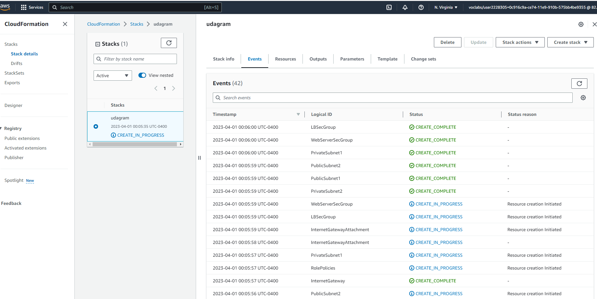

# Deploy a high-availability web app using CloudFormation

In this project, I create a dummy application and provision the required infrastructure. This includes setting up compute, networks, load balancers and security rules.

## Deployment

Run the create.sh file to initiate deployment with AWS CloudFormation.

`.\create.sh udagram udagram_infra.yml udagram_params.json`

## Output
Once completed, the dummy web app can be tested by calling the load balancer url

## Challenges

Installing apache via apt-get did not work as expected. I had to [install httpd](https://docs.oracle.com/en/operating-systems/oracle-linux/6/admin/install-apache.html) via yum in order to create a webserver
